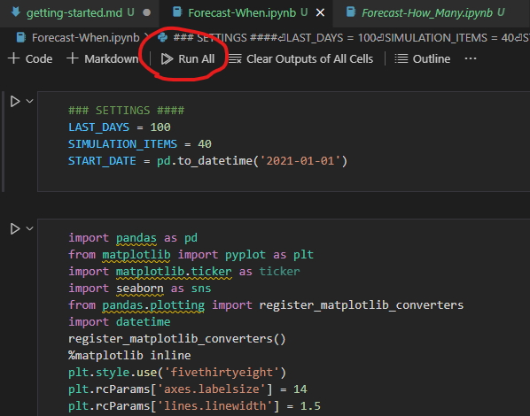
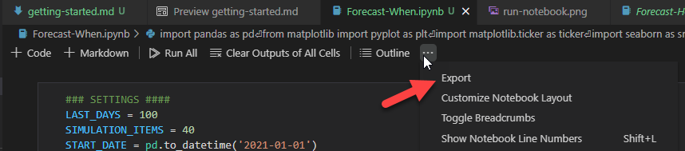

# Getting Started

## Required Software

- [Docker](https://www.docker.com/products/docker-desktop)
- VS Code
- VS Code Extension: [Remote Containers](https://marketplace.visualstudio.com/items?itemName=ms-vscode-remote.remote-containers)

## Opening the Project

1. Open the repo's root in VS Code.
2. `Ctrl + Shift + P`, search and then select `Remote Containers: Rebuild and Reopen in Container`
   > This will build the dev container and re-open VS Code with it. The dev container contains all the required software to run the notebooks.

## Getting Historical Dataset

Historical data is read from a CSV file named `Historical Data for Forecasting.csv`. The only requirements for the file are:

- contains headings as first line
- contains "Completed Date" and "Work Item Type" columns

## Running a Notebook

1. Open a notebook; e.g., `Forecast-When.ipynb`
2. Specify the settings configuration to run for your forecast:

```python
LAST_DAYS = 100 # last `P` days to forecast from
SIMULATION_ITEMS = 40 # The number of work items to forecast.
DATE_TO_BEGIN_WORKING_ON_ITEMS ='2021-01-01' # When the work will begin for the SIMULATION_ITEMS work items.
```

3. Click `Run All`.

   > If prompted for a Python version, use `3.8.*`.

   

4. Export the results as HTML.

   > Currently PDF is not supported in the devcontainer.

   
