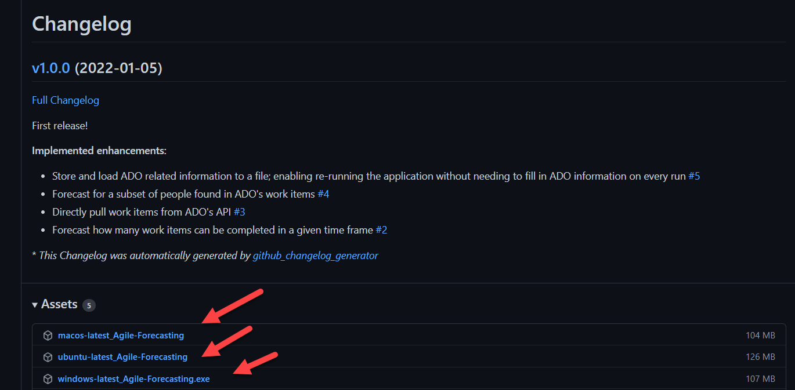
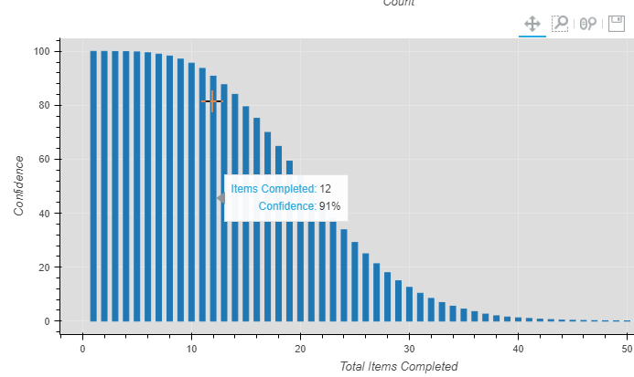

# Agile Forecasting

Predict a team or subset of your team's ability to complete user stories by using historical data from Azure DevOps.

1. Predict the number of days with a confidence level for team members, 1, 2, 3, to complete N user stories.
2. Predict, with a confidence level, how many user stories can team members, 1, 2, etc., complete in N days.


## Getting Started

> Download the [latest release](https://github.com/andrew-codes/forecast-work/releases) for Windows, OSX, or Linux



Running the downloaded executable will open a Terminal. It may take a moment to start, but once ready a browser window will automatically open showing the forecasting tool.

## Using the Forecasting Tool

> The tool is laid out in three columns. Fill in each column before proceeding to the next one.

### Querying for Historical Data

Historical data is queried from Azure DevOps (ADO) directly through its API. For this reason, we need to set the ADO URL and provide a user access token. See this [guide](https://docs.microsoft.com/en-us/azure/devops/organizations/accounts/use-personal-access-tokens-to-authenticate?view=azure-devops&tabs=preview-page#create-a-pat) on creating an ADO personal access token. The ADO URL is the following format:

```
http://dev.azure.com/$ORGANIZATION/$PROJECT
```

You can also customize the query used for retriveing your team's historical data via editing the [WiQL](https://docs.microsoft.com/en-us/azure/devops/boards/queries/wiql-syntax?view=azure-devops) query. The recommendation is to update it to pull all user stories under your team's area path. Once updated, click Query Work Items to see the pulled histoical data.

> An example of a WiQL to query work items under your team's area path.

```
Select [System.Id] From WorkItems Where [System.WorkItemType] = 'User Story' AND [State] = 'Closed' AND [System.AreaPath] under '$YOUR_TEAMS_AREA_PATH'
```

### Selecting the Forecast Type and Selecting Team Members

In the second column, you can choose which type of forecasting you wish to make. Each selected option will show the releveant inputs it needs.

Once selected and filled out, you are able to choose which team members to include in your forecast. This is helpful if you have a subset of the team dedicated to a particular feature. Team members are automatially populated from the historical data. Finally, click the run button.

> **NOTE**: the forecasting takes a moment, so please be patient. It uses random sampling to create 10,000 what-if scenarios used for its prediction.

### Interpretting the Charts

Once completed, three graphs will show in the third column. The first one is the throughput of your selected team members on a weekly basis. The througput is used in to forecast. The second graph is the distribution of the what-if scenarios. It shows how many of the 10,000 scenarios were the same by grouping them.

Finally, the bottom chart is the one that will answer our forecasting questions! On the y-axis is the confidence level for the given x-axis. Generally, a rule of thumb is 80% or below is risky, 90% or above is not considered risky.

> An example predicting the number of work items that can be completed in a two week sprint (14 days).

)

## Contributing

### Required Software for Development

- [Docker](https://www.docker.com/products/docker-desktop)
- VS Code
- VS Code Extension: [Remote Containers](https://marketplace.visualstudio.com/items?itemName=ms-vscode-remote.remote-containers)

### Running Locally

1. Open the repo's root in VS Code.
2. `Ctrl + Shift + P`, type and select `Remote Containers: Rebuild and Reopen in Container`
   > This will build the dev container and re-open VS Code with it. The dev container contains all the required software for local development.
3. In the VS Code terminal, run `python src/app.py` and navigate in your browser to [http://localhost:5007](http://localhost:5007).
