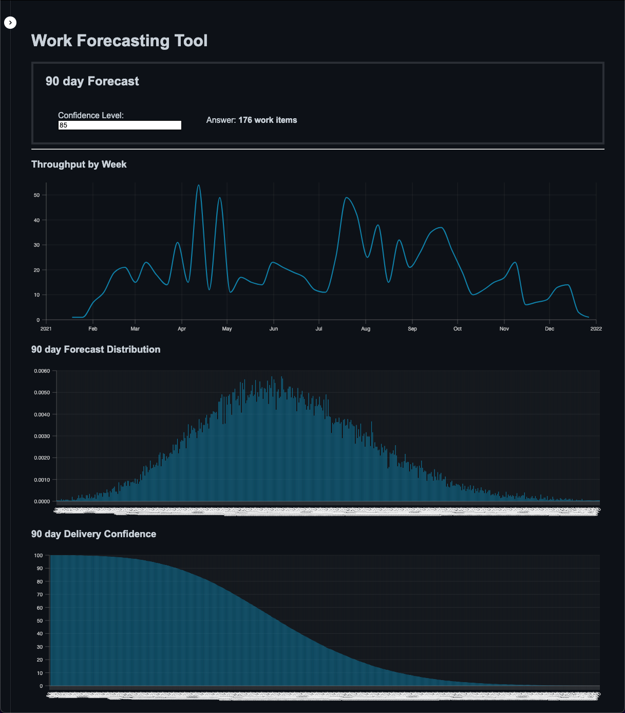
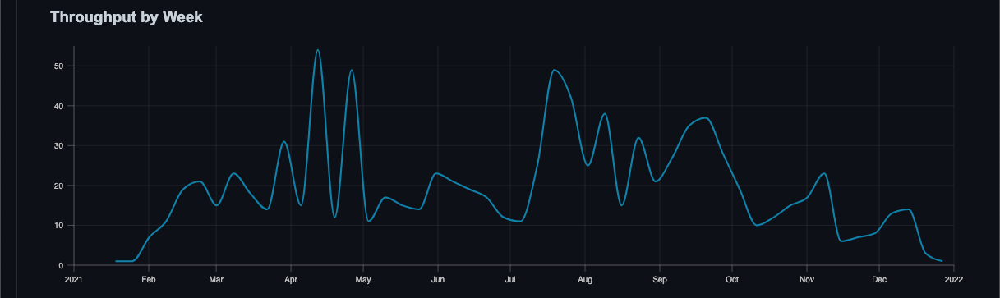
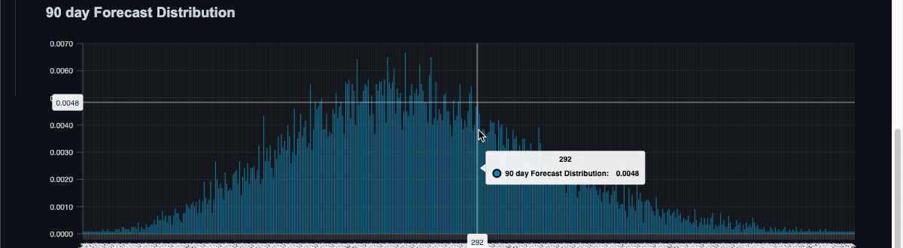
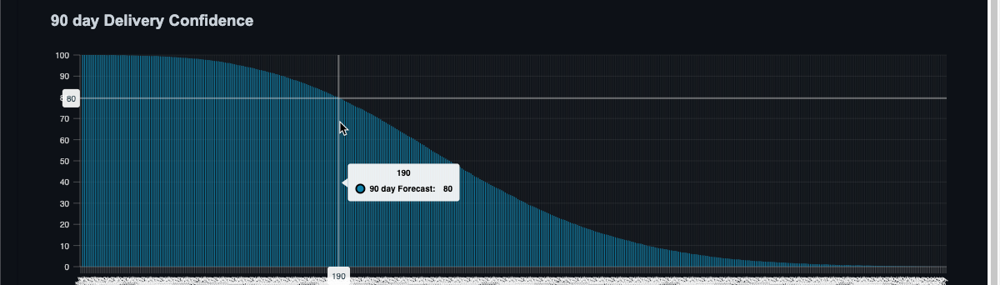

# Agile Forecasting

## Elevator Pitch

This is a desktop application that enables you to answer the following questions using actual historical data of your team:

1. What is the time frame and its confidence level for my team to deliver N work items?
2. How many work items can be delivered in N days and how confident is this prediction?

## What is Required to Forecast?

> The **only information** needed is the **completion date** for all work items in the last 90 days.

- Work items **do not** need to be estimated; hours, points, etc.
- Work items **do not** have to be the same size.

## How does this even Work?

> Tl;dr: the application uses a statistical analysis technique called the Monte Carlo method.

First, the completion date of every work item is gathered to create your team's throughput. This is the number of stories completed each day over a period of time. A daily interval is used for calcuations, but a weekly interval is also shown in a graphical form by the tool. The throughput is not a single value, rather a series of varying numbers of completed work items.

Next, this throughput is used with random sampling to create a possible outcome; answering one of the two questions in the elevator pitch. This same process happens over a thousand times. Due to random sampling, they will not all be the same, but some scenarios may occur more than once.

The likelihood of a given scenario, for every scenario, can be plotted on a graph. This creates a normal distribution. The probability of any given point is the value of the area underneath its curve. This is then calculated for every point in the distribution.

The application then sorts these scenarios by the statistical likelihood of them occurring. The more likely a scenario is repeated, the more confidence it garners for being accurate. These sorted scenarios are plotted to form the final graph. This graph shows for any given scenario how likely it is to occur. The greater the confidence (y-axis), the more likely the scenario (x-axis) is to occur.

> Generally, 85% or above is considered confident and a value of 75% is considered risky. It is not recommend to use a value with confidence less than 75%.

## How do I get Started?

Download the latest release for your platform from the [Releases page](https://github.com/andrew-codes/forecast-work/releases). Windows, MacOSX, and Linux are all supported.

## What if I find something Defective or an Issue?

1. First, please check your issue already exists. You can search open issues on [GitHub issues](https://github.com/andrew-codes/forecast-work/issues).
2. If you cannot find your problem already opened as an issue, then please open a new [GitHub issue](https://github.com/andrew-codes/forecast-work/issues/new).

## What if I want to Contribute?

Visit the [contributing guide](./docs/contributing.md) for more details.
